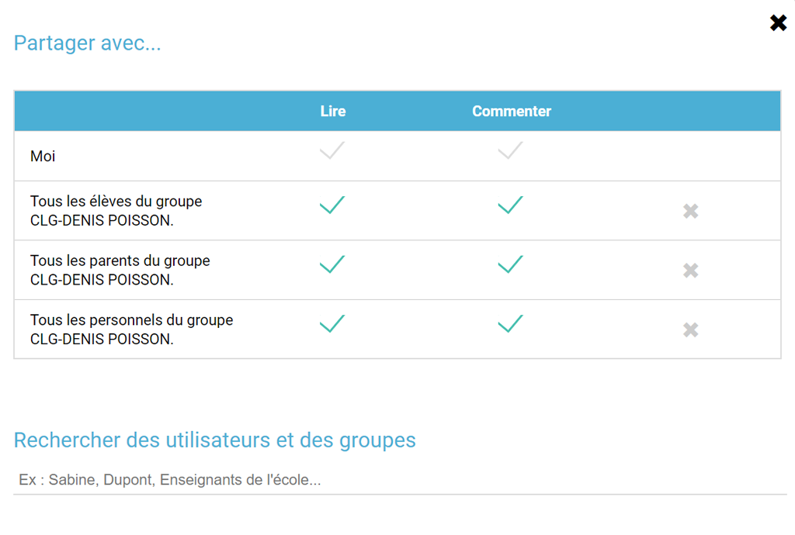
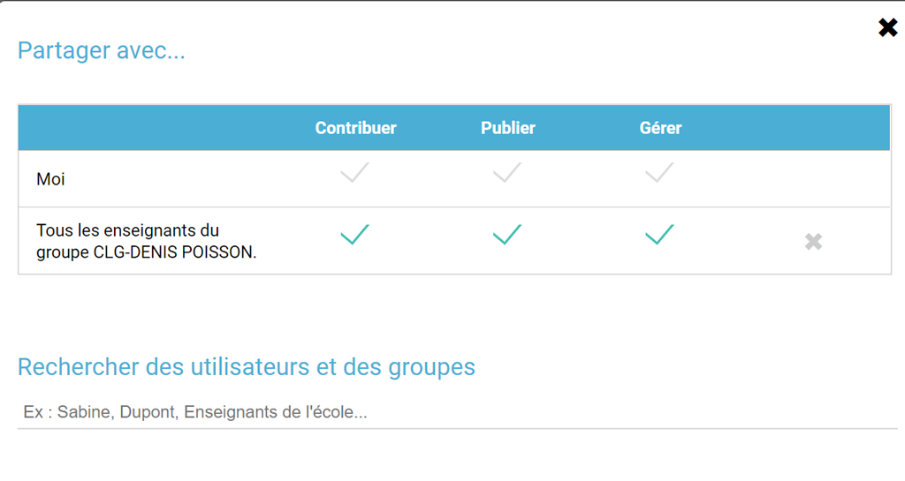

# Actualités

L’appli **Actualités** permet de publier des informations organisées selon différentes thématiques en ciblant les destinataires.

* [Présentation](https://github.com/rdjedjig/test/tree/3238c182f08d33cb073b2a487612e589768c5227/application/actualites/index.html?iframe=true#presentation)
* [Créer un fil d’actualités](actualites.md#cas-d-usage-1)
* [Partager un fil d’actualités](actualites.md#cas-d-usage-2)
* [Créer une actualité](https://github.com/rdjedjig/test/tree/3238c182f08d33cb073b2a487612e589768c5227/application/actualites/index.html?iframe=true#cas-d-usage-3)
* [Partager une actualité](https://github.com/rdjedjig/test/tree/3238c182f08d33cb073b2a487612e589768c5227/application/actualites/index.html?iframe=true#cas-d-usage-4)
* [Note de version](https://github.com/rdjedjig/test/tree/3238c182f08d33cb073b2a487612e589768c5227/application/actualites/index.html?iframe=true#notes-de-versions)

\[image:../../wp-content/uploads/2015/03/CC-BY-NC-SA-3.0-FR-300x105.png[CC BY-NC-SA 3.0 FR,width=100,height=35](http://creativecommons.org/licenses/by-nc-sa/3.0/fr/)\]

## Présentation {#presentation}

Cet outil vous permet de **diffuser facilement une information** \(comme le déroulement d’un événement ou le menu de la cantine\) en y intégrant différents types de contenus : texte, images, fichiers audio, vidéos, liens externes, etc. Les actualités créées sont associées à un **fil d’actualités** permettant aux utilisateurs de voir tous les contenus qui y sont rattachés.

Lorsque vous publiez une actualité, vous choisissez les utilisateurs ou les groupes de personnes avec lesquels vous souhaitez partager l’information. Les personnes concernées reçoivent une **notification** dans leur **fil de nouveautés** et voient apparaître l’actualité dans le **widget Actualités**.

## Créer un fil d’actualités {#cas-d-usage-1}

Pour créer un fil d’actualités, suivez les étapes suivantes :

1. Cliquez sur le bouton « Gestion des fils »
2. Cliquez sur « Nouveau fil »
3. Saisissez le titre du fil
4. Choisissez une image d’illustration
5. Cliquez sur « Sauvegarder »

Par défaut seuls les enseignants et les personnels sont habilités à créer des fils d’actualités.

## Partager un fil d’actualités {#cas-d-usage-2}

Vous pouvez maintenant partager votre fil d’actualités :

1. Cliquez sur « Gérer les fils »
2. Sélectionnez la case à cocher du fil à partager
3. Cliquez sur « Partager »

  Pour partager le fil d’actualités avec d’autres utilisateurs, suivez les étapes suivantes :

1. Saisissez les premières lettres du nom de l’utilisateur ou du groupe d’utilisateurs que vous recherchez
2. Sélectionnez le résultat
3. Cochez les cases correspondant aux droits que vous souhaitez leur attribuer.

Les différents droits que vous pouvez attribuer aux autres utilisateurs de l’ENT sur le fil d’actualités sont les suivants :

* **Contribuer** : l’utilisateur peut créer des actualités qui vous seront soumises avant publication
* **Publier** : l’utilisateur peut publier des actualités dans le fil
* **Gérer **: l’utilisateur peut modifier, partager ou supprimer le fil d’actualités

## Créer une actualité {#cas-d-usage-3}

Pour créer une actualité, cliquez sur le bouton « Nouvelle actualité ».

Dans la nouvelle fenêtre, indiquez le titre de l’actualité \(1\), le fil auquel l’actualité sera rattachée \(2\), les dates de publication et d’expiration \(3\), et le contenu de votre actualité \(4\). La case à cocher « Mettre à la une » permet de laisser votre actualité en haut de la liste.

Plusieurs actions sont ensuite proposées :

* **Annuler** pour annuler votre saisie et revenir à la liste des actualités
* **Publier** votre actualité
* **Enregistrer** : votre actualité n’est pas publiée et vous pouvez la compléter plus tard

## Partager une actualité {#cas-d-usage-4}

Vous pouvez décider d’attribuer des droits sur une actualité indépendamment des droits de partage définis sur le fil auquel elle appartient.

Pour cela, cliquez sur la case à cocher de l’actualité concernée \(1\) puis sur « Partager » \(2\).

Pour attribuer ces droits, suivez les étapes suivantes :

1. Saisissez les premières lettres du nom de l’utilisateur ou du groupe d’utilisateurs que vous recherchez
2. Sélectionnez le résultat
3. Cochez les cases correspondant aux droits que vous souhaitez leur attribuer :

Les différents droits que vous pouvez attribuer aux autres utilisateurs de l’ENT sur l’actualité sont les suivants :

* **Lire** : l’utilisateur peut lire le contenu de l’actualité
* **Commenter **: l’utilisateur peut laisser un commentaire sous l’actualité

## Note de version {#notes-de-versions}

Nouveauté de la version 0.4.0

**Diffusion d’une actualité**

La diffusion d’une actualité se définit maintenant au niveau de l’actualité elle-même et plus au niveau du fil d’actualités.

Les droits suivants sont définis au niveau des actualités :

* Lire
* Commenter

Le fil d’actualités permet toujours de définir des droits de :

* Gestion
* Publication
* Contribution

Nouveauté de la version 0.11

**Évolution de la présentation des actualités**

Modifications de la présentation des actualités. Les menus des fils et des filtres ont été mis en évidence pour être plus identifiables.

