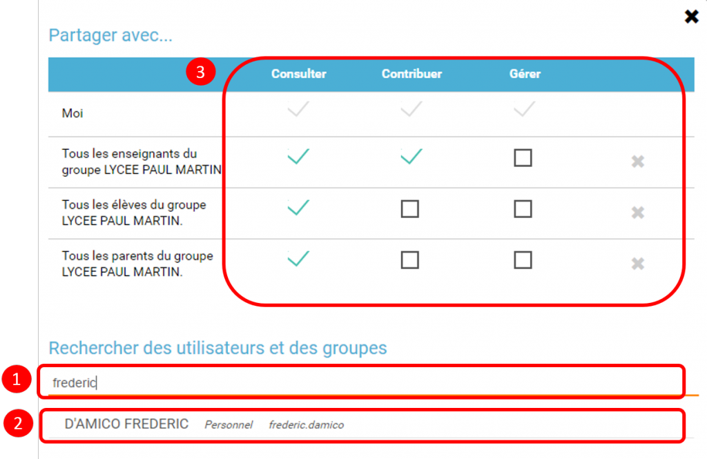

L’appli **Pages** est un outil de création et publication de contenus,
permettant de créer des mini sites web**.**

-   [Présentation](index.html?iframe=true#presentation)

-   [Créer un projet](index.html?iframe=true#cas-d-usage-1)

-   [Partager un projet](index.html?iframe=true#cas-d-usage-2)

-   [Créer et éditer une nouvelle
    page](index.html?iframe=true#cas-d-usage-3)

-   [Note de version](index.html?iframe=true#notes-de-versions)

[image:../../wp-content/uploads/2015/03/CC-BY-NC-SA-3.0-FR-300x105.png[CC
BY-NC-SA 3.0
FR,width=100,height=35](http://creativecommons.org/licenses/by-nc-sa/3.0/fr/)]

Présentation {#presentation}
------------

L’appli Pages permet de créer des pages web qui sont organisées entre
elles grâce à un menu de navigation, et offrant une grande liberté de
mise en page du contenu.

Il est possible d’insérer dans ces pages **différents **types de
contenus** (**texte, image, son, vidéo…) et**des liens vers d’autres
contenus**. En particulier, si un lien est enregistré vers un blog, une
frise chronologique, un wiki, ou un forum existant, la page sera
automatiquement mise à jour avec les nouvelles publications effectuées
dans le blog, la frise, le wiki ou le forum.

[image:../../wp-content/uploads/2017/04/Captures-Pages-1.png[Captures
Pages
1,width=643,height=413](../../wp-content/uploads/2017/04/Captures-Pages-1.png)]

Créer un projet {#cas-d-usage-1}
---------------

Depuis la page d’accueil, cliquez sur « Mes applis » en haut à droite de
l’écran puis cliquez sur « Pages ».

-   Pour créer un projet : Cliquez sur «  Créer un un projet» (1)

-   Choisissez ensuite si vous voulez créer un projet privé ou public
    (2)

Lorsque vous créez un site public celui-ci est visible de tous dans
l’ENT. De plus, toute personne extérieure à l’ENT peut accéder à ce site
si elle dispose du lien.

 

[image:../../wp-content/uploads/2017/04/Captures-Pages-2.png[Captures
Pages
2,width=550](../../wp-content/uploads/2017/04/Captures-Pages-2.png)]

[image:../../wp-content/uploads/2017/04/Capture-Pages-3.png[Capture
Pages
3,width=550](../../wp-content/uploads/2017/04/Capture-Pages-3.png)]

 

Dans la fenêtre, saisissez le titre de votre site (3) puis cliquez sur
le bouton « Créer » (4)

[image:../../wp-content/uploads/2017/04/Captures-Pages-4.png[Captures
Pages
4,width=300](../../wp-content/uploads/2017/04/Captures-Pages-4.png)]

Votre site web est maintenant créé, vous pouvez le compléter en y
intégrant des contenus.

Partager un projet {#cas-d-usage-2}
------------------

Pour partager votre page, avec d’autres utilisateurs, suivez les étapes
suivantes :

1.  Sélectionnez la case à cochez de la page (1)

2.  Cliquez sur le bouton "Partager" (2)

[image:../../wp-content/uploads/2017/04/Captures-Pages-5.png[Captures
Pages
5,width=550](../../wp-content/uploads/2017/04/Captures-Pages-5.png)]

La fenêtre de partage apparaît. Pour attribuer des droits à d’autres
utilisateurs, suivez les étapes suivantes :

1.  Saisissez les premières lettres du nom de l’utilisateur ou du groupe
    d’utilisateurs que vous recherchez (1).

2.  Sélectionnez le nom de l’utilisateur ou du groupe (2).

3.  Cochez les cases correspondant aux droits que vous souhaitez leur
    attribuer (3).

Vous pouvez attribuer différents droits aux autres utilisateurs de
l’ENT :

-   Consulter : l’utilisateur peut consulter la page

-   Contribuer : l’utilisateur peut créer des pages qui vous seront
    soumises avant publication

-   Gérer : l’utilisateur peut modifier, partager ou supprimer la page

Créer et éditer une nouvelle page {#cas-d-usage-3}
---------------------------------

Pour créer une nouvelle page, vous pouvez   :

-   Cliquer sur l’icône d’ajout d’une page sur lorsque vous éditez votre
    projet (1)

[image:../../wp-content/uploads/2017/04/Captures-Pages-6.png[Captures
Pages
6,width=681,height=269](../../wp-content/uploads/2017/04/Captures-Pages-6.png)]

-   Ou cliquer sur gérer les pages (2), puis sur "nouvelle page" (3)

 [image:../../wp-content/uploads/2017/04/Capture-Pages-7.png[Capture
Pages
7,width=683,height=280](../../wp-content/uploads/2017/04/Capture-Pages-7.png)]
