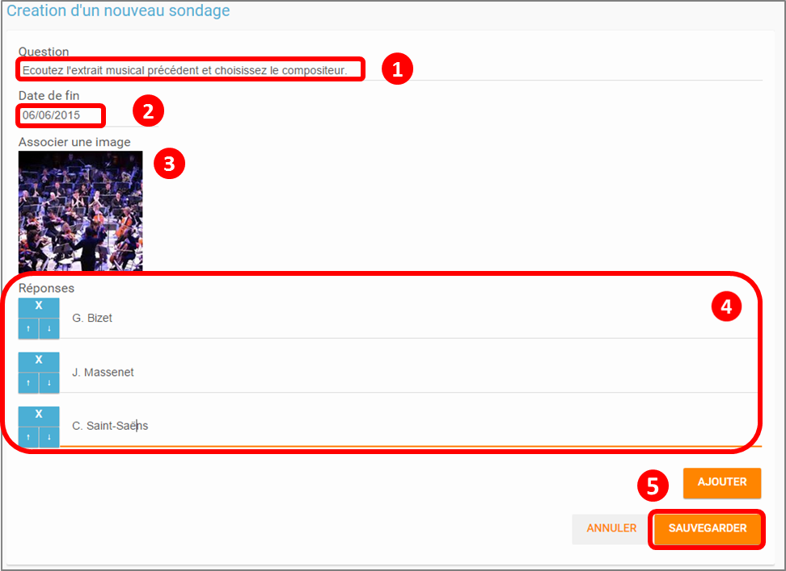
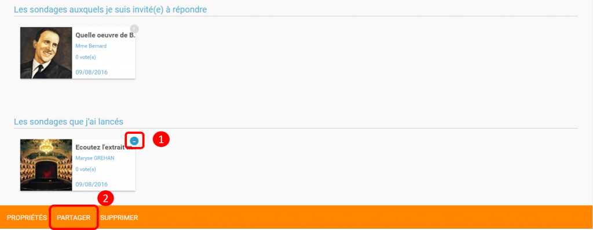
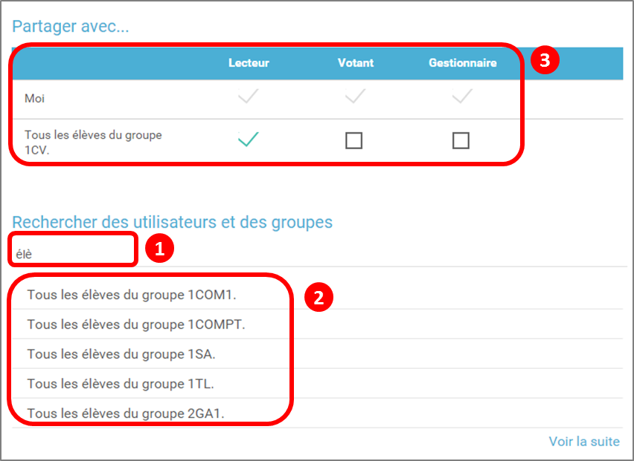
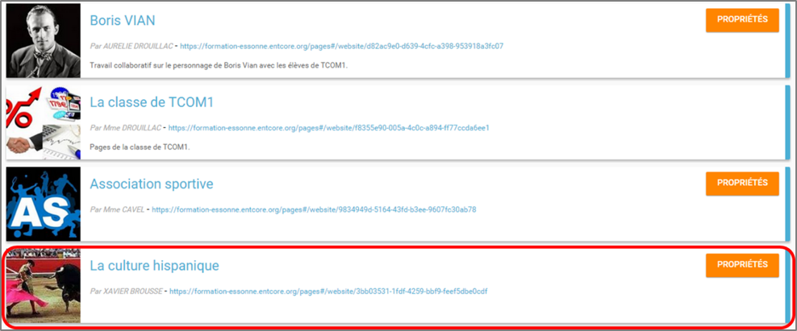
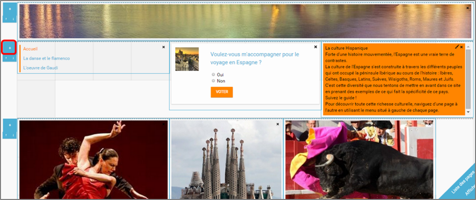
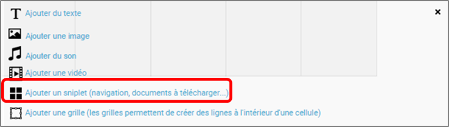
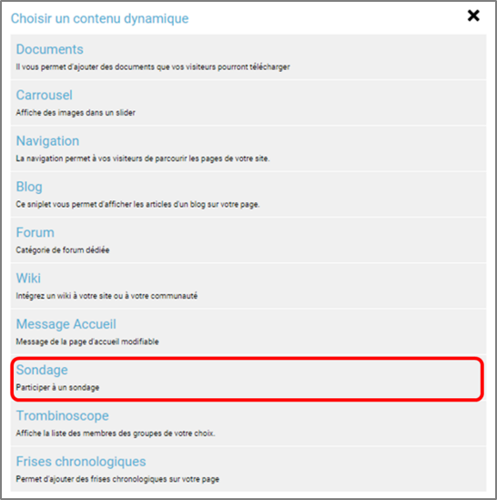
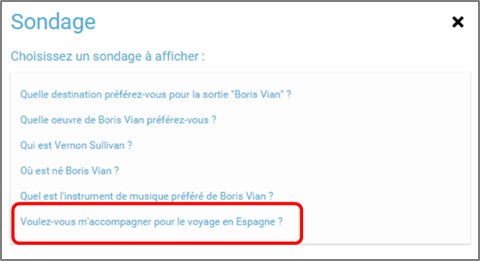

L’appli **Sondage** permet de **créer une question** à laquelle les
utilisateurs sélectionnés peuvent répondre, en **choisissant une**
**réponse dans la liste proposée.**

-   [Présentation](index.html?iframe=true#presentation)

-   [Créer un sondage](index.html?iframe=true#cas-d-usage-1)

-   [Partager un sondage](index.html?iframe=true#cas-d-usage-2)

-   [Insérer un sondage dans une
    page](index.html?iframe=true#cas-d-usage-3)

-   [Note de version](index.html?iframe=true#notes-de-versions)

[image:../../wp-content/uploads/2015/03/CC-BY-NC-SA-3.0-FR-300x105.png[CC
BY-NC-SA 3.0
FR,width=100,height=35](http://creativecommons.org/licenses/by-nc-sa/3.0/fr/)]

Présentation {#presentation}
------------

L’appli Sondage permet de créer des **sondages qui pourront être
intégrés dans des pages web** (en utilisant l’appli Pages).
L’utilisateur qui crée le sondage peut attribuer **différents droits**
aux utilisateurs qu’il choisit : droit de **lecture** (accès au sondage
en consultation), droit de **vote** (possibilité de répondre au sondage)
et droit de **gestion** (possibilité de modifier et supprimer le
sondage).

Créer un sondage {#cas-d-usage-1}
----------------

Pour accéder à l’appli Sondage, cliquez sur l’icône correspondante dans
la page « Mes applis ».

Cliquez sur "Créer un sondage".

1.  Saisissez une question

2.  Choisissez une date de fin de validité

3.  Chargez une image d’illustration si vous le souhaitez

4.  Saisissez les réponses possibles à la question. Pour ajouter
    d’autres réponses, cliquez sur "Ajouter"

5.   Cliquez sur « Sauvegarder »

 \
 Le sondage est maintenant créé.

Partager un sondage {#cas-d-usage-2}
-------------------

Pour partager le sondage, cliquez sur le + (1), puis sur « Partager »
(2).

 \
 Dans la fenêtre de partage, vous pouvez donner des droits de  lecture,
de vote et de gestion à d’autres personnes sur votre sondage. Pour cela,
saisissez les premières lettres du nom de l’utilisateur ou du groupe
d’utilisateurs que vous recherchez (1), sélectionnez le résultat (2) et
cochez les cases correspondant aux droits que vous souhaitez leur
attribuer (3).

Les différents droits que vous pouvez attribuer sont les suivants :

-   Lecture : l’utilisateur peut visualiser le sondage

-   Vote : l’utilisateur peut répondre au sondage

-   Gestion : l’utilisateur peut partager, modifie et supprimer le
    sondage

 \
 Votre sondage est bien créé et partagé.

Insérer un sondage dans une page {#cas-d-usage-3}
--------------------------------

Une fois le sondage créé et partagé,  il est possible de l’insérer dans
une page. Pour cela, cliquez sur l’appli « Pages ».

Cliquez sur le site dans lequel vous souhaitez insérer le sondage.

 \
 Pour insérer le sondage, cliquez sur l’icône suivante:\
  \
 

Cliquez sur « Ajouter un sniplet ».

Puis choisissez l’appli Sondage.

La liste des sondages dont vous êtes gestionnaire apparaît. Choisissez
celui que vous souhaitez faire apparaître.

Le sondage apparaît bien sur la page.

Note de version {#notes-de-versions}
---------------

A chaque nouvelle version de l’application, les nouveautés seront
présentées dans cette section.
