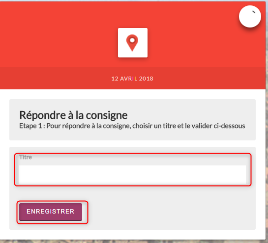
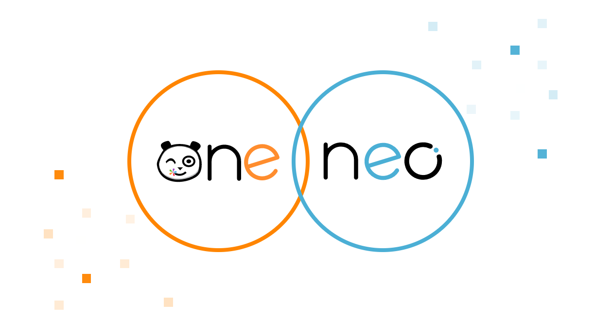

# Cahier de textes 1D

* [Présentation](https://github.com/rdjedjig/test/tree/3238c182f08d33cb073b2a487612e589768c5227/application/751/index.html?iframe=true#presentation)
* [Créer un cahier de textes](https://github.com/rdjedjig/test/tree/3238c182f08d33cb073b2a487612e589768c5227/application/751/index.html?iframe=true#cas-d-usage-1)
* [Partager un cahier de textes](https://github.com/rdjedjig/test/tree/3238c182f08d33cb073b2a487612e589768c5227/application/751/index.html?iframe=true#cas-d-usage-2)
* [Créer une activité](https://github.com/rdjedjig/test/tree/3238c182f08d33cb073b2a487612e589768c5227/application/751/index.html?iframe=true#cas-d-usage-3)
* [Note de version](https://github.com/rdjedjig/test/tree/3238c182f08d33cb073b2a487612e589768c5227/application/751/index.html?iframe=true#notes-de-versions)

\[image:../../wp-content/uploads/2015/03/CC-BY-NC-SA-3.0-FR-300x105.png[CC BY-NC-SA 3.0 FR,width=100,height=35](http://creativecommons.org/licenses/by-nc-sa/3.0/fr/)\]




### Présentation {#presentation}

Il est facile de publier les devoirs des élèves dans le cahier de textes. Les élèves y accèdent jour par jour et disposent également d’une synthèse de la semaine \(vue semaine\).

{% embed data="{\"url\":\"https://www.youtube.com/watch?v=foR9lUwPBRk\",\"type\":\"video\",\"title\":\"Monstres 2.0, l\'autre visage des réseaux sociaux : Quel rôle peut jouer l\'école\",\"description\":\"Ultra connectés, les jeunes mesurent rarement les dangers liés aux mauvaises pratiques sur les réseaux sociaux \(contenus violents, harcèlement, fake news…\). Comment les préparer à un usage responsable et éclairé de ces plateformes ? L’école est-elle en mesure d’apporter une solution durable ?\n\nPropos recueillis durant la conférence \\"Monstres 2.0, l\'autre visage des réseaux sociaux\\" qui s\'est tenue le jeudi 15 Mars 2018, pendant le salon EduSpot au Palais des Congrès de Paris.\n\nNous remercions pour leur intervention :\n- Pauline Escande-Gauquié, Maître de conférences à l’Université Sorbonne-Celsa, sémiologue et experte de l’analyse des nouveaux médias\n- Peggy Colcanap, proviseur adjointe au collège Courteline\n- Philippe Taillard, Délégué Académique au Numérique de l’académie de Paris\n- Olivier Vigneau, co-fondateur d\'Open Digital Education\",\"icon\":{\"type\":\"icon\",\"url\":\"https://www.youtube.com/yts/img/favicon\_144-vfliLAfaB.png\",\"width\":144,\"height\":144,\"aspectRatio\":1},\"thumbnail\":{\"type\":\"thumbnail\",\"url\":\"https://i.ytimg.com/vi/foR9lUwPBRk/maxresdefault.jpg\",\"width\":1280,\"height\":720,\"aspectRatio\":0.5625},\"embed\":{\"type\":\"player\",\"url\":\"https://www.youtube.com/embed/foR9lUwPBRk?rel=0&showinfo=0\",\"html\":\"<div style=\\"left: 0; width: 100%; height: 0; position: relative; padding-bottom: 56.2493%;\\"><iframe src=\\"https://www.youtube.com/embed/foR9lUwPBRk?rel=0&amp;showinfo=0\\" style=\\"border: 0; top: 0; left: 0; width: 100%; height: 100%; position: absolute;\\" allowfullscreen scrolling=\\"no\\"></iframe></div>\",\"aspectRatio\":1.7778},\"caption\":\"video\"}" %}


> Application très pratique
>
> ## Ceci est un titre
>
> Voici le texte de la recette du gitbook ! Si je mets **en gras**, c'est facile, si je mets _en italique_, c'est possible, et le ~~barré~~ aussi, pour changer la couleur ?

> ### Ceci est un titre 2
>
> * Bullet points
> * blablabla
>
> 1. test 1
> 2. test 2


* [x] tâche !
* [ ] tâche vide

```text
https://www.youtube.com/watch?v=xHnbFDFrmxw

```


> Ceci est une citation !!!!





## Créer un cahier de textes {#cas-d-usage-1}

Le cahier peut être partagé avec un utilisateur ou un groupe d’utilisateurs, selon les souhaits de l’enseignant.

Pour accéder à l’appli Cahier de textes, cliquez sur l’icône correspondante dans la page « Mes applis ».


Pour créer un nouveau cahier de textes, cliquez sur le bouton « Créer » en haut de la page.


Votre cahier est désormais créé mais n’est pas encore visible.

## Partager un cahier de textes {#cas-d-usage-2}

Pour partager un cahier de textes avec d’autres utilisateurs, cliquez sur la case à cocher \(1\) située à côté du cahier puis sur « Partager » \(2\).


Dans la fenêtre de partage, vous pouvez donner des droits de lecture, de contribution et de gestion à d’autres personnes sur votre cahier. Pour cela, saisissez les premières lettres du nom de l’utilisateur ou du groupe d’utilisateurs que vous recherchez \(1\), sélectionnez le résultat \(2\) et cochez les cases correspondant aux droits que vous souhaitez leur attribuer \(3\).


Votre cahier de textes est initialisé, vous pouvez désormais créer les premières activités ! Les différents droits que vous pouvez attribuer sont les suivants :

* Lecture : l’utilisateur visualise le cahier de textes
* Contribution : l’utilisateur peut créer des activités dans le cahier de textes
* Gestion : l’utilisateur peut partager, modifier et supprimer le cahier de textes

## Créer une activité {#cas-d-usage-3}

Une fois votre cahier de textes créé, vous pouvez y ajouter des activités. Pour cela, cliquez sur le titre du cahier dans le dossier correspondant.


Lorsque le cahier est affiché à l’écran, cliquez sur un jour de la semaine pour saisir une nouvelle activité.


Une fois le jour sélectionné, cliquez sur le bouton « Créer ».


Vous pouvez ajouter une activité directement dans le cahier. Tout d’abord, saisissez la matière dans la colonne de gauche.


Cliquez dans la colonne principale pour afficher l’éditeur de texte.


Comme pour les autres services, vous pouvez intégrer plusieurs types de contenus dans l’activité : texte, image, lecteur audio, lecteur vidéo, formule mathématique…

Lorsque vous saisissez des contenus, l’enregistrement des données est automatique. Il suffit de cliquer dans la zone de saisie pour effectuer les modifications.

Une fois que vous avez terminé, cliquez sur le bouton « Afficher la vue semaine » pour revenir à la page d’accueil du cahier.


La semaine en cours est affichée par défaut. Pour saisir une activité pour une semaine ultérieure, vous pouvez soit faire défiler les semaines en cliquant sur les flèches \(1\) soit sélectionner la date dans le calendrier \(2\).


## Note de version {#notes-de-versions}

A chaque nouvelle version de l’application, les nouveautés seront présentées dans cette section.

